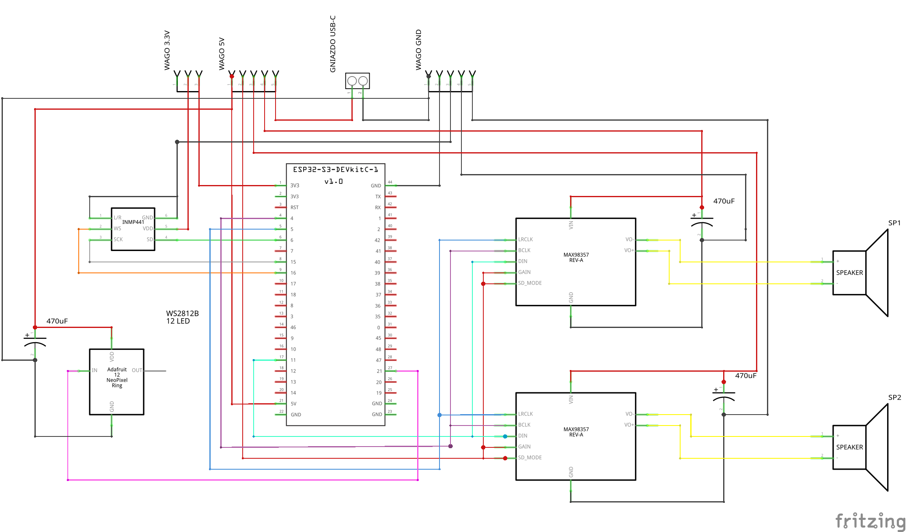

🇵🇱 Wersja polska | [🇬🇧 English version](README_EN.md)

# ESP32-S3 Voice Satellite dla Home Assistant


[](https://buycoffee.to/Krisuuuu)

> ✅ **Status Projektu:** Stabilna wersja produkcyjna z pełnym wsparciem media player i zaawansowanymi efektami LED.

Zaawansowany satelita głosowy dla Home Assistant oparty na ESP32-S3. Projekt wykorzystuje dwie niezależne magistrale I2S dla dźwięku wysokiej jakości oraz pierścień LED WS2812B dla wizualnej informacji zwrotnej.

## ✨ Funkcje

### 🎤 Audio
- **3 Wake Words:** Alexa, Okay Nabu, Hey Jarvis (lokalna detekcja)
- **Dual Mono Output:** 2x MAX98357A na wspólnej linii danych (zwiększona głośność)
- **Media Player:** Jednoczesne odtwarzanie ogłoszeń i muzyki (mixer)
- **Wysoka jakość:** 32-bit mikrofon (16kHz), 16-bit wzmacniacze (48kHz)

### 💡 LED (WS2812B)
- **Boot Filling:** Stopniowe zapełnianie przy starcie (cyan)
- **Connection Breathe:** Zielony oddech przy połączeniu
- **Listening Double:** Niebieski wirujący efekt (2 punkty)
- **Thinking Pulse:** Niebieski pulsujący efekt
- **Speaking Reverse:** Fioletowy odwrotny wirujący efekt
- **Error:** Czerwone mruganie

### 🎛️ Sterowanie
- **Mute Switch:** Wyciszenie mikrofonu (czerwony LED)
- **Push-to-Talk:** Przycisk w Home Assistant
- **Auto Re-Arm:** Automatyczne ponowne uruchomienie wake word

---

## 🛠️ Sprzęt (BOM)

| Element | Model | Ilość | Uwagi |
|---------|-------|-------|-------|
| **MCU** | ESP32-S3 DevKitC-1 N8R16 | 1 | 8MB Flash / 16MB PSRAM |
| **Mikrofon** | INMP441 | 1 | I2S MEMS |
| **Wzmacniacz** | MAX98357A | 2 | Równolegle na GPIO11 |
| **LED** | WS2812B Ring | 1 | 12 diod |
| **Zasilacz** | 5V 3A | 1 | Min. 2.5A |
| **Kondensatory** | 470µF 16V | 3 | Przy każdym wzmacniaczu + LED |
| **Bezpiecznik** | 3A | 1 | Opcjonalnie |

---

## 🔌 Schemat Podłączenia (Pinout)

### Magistrala Mikrofonu (I2S Bus #1)
| Pin ESP32 | → | Mikrofon INMP441 | Funkcja |
|-----------|---|------------------|---------|
| **GPIO15** | → | **SCK** | Bit Clock |
| **GPIO16** | → | **WS** | Word Select |
| **GPIO6** | → | **SD** | Data In |
| **3.3V** | → | **VDD** | Zasilanie ⚠️ |
| **GND** | → | **GND** | Masa |
| **GND** | → | **L/R** | Kanał lewy |

### Magistrala Wzmacniaczy (I2S Bus #2)
| Pin ESP32 | → | 2x MAX98357A | Funkcja |
|-----------|---|--------------|---------|
| **GPIO4** | → | **BCLK** | Bit Clock |
| **GPIO5** | → | **LRC** | Word Select |
| **GPIO11** | → | **DIN** (oba) | Data Out (równolegle) |
| **5V** | → | **Vin** + **SD** + **GAIN** | Zasilanie + Enable |
| **GND** | → | **GND** | Masa |

### LED Ring
| Pin ESP32 | → | WS2812B | Funkcja |
|-----------|---|---------|---------|
| **GPIO21** | → | **DI** | Data In |
| **5V** | → | **5V** | Zasilanie |
| **GND** | → | **GND** | Masa |

> ⚠️ **KRYTYCZNE:**
> - Mikrofon **TYLKO 3.3V** (5V zniszczy układ!)
> - Kondensatory 470µF przy **każdym** wzmacniaczu i LED
> - Wspólna masa (GND) dla wszystkich komponentów
> - SD i GAIN wzmacniaczy podłączone do 5V (pełna głośność)

### 📐 Schemat Połączeń



> 📐 **Szczegóły tekstowe:** Zobacz [docs/SCHEMATIC.md](docs/SCHEMATIC.md)

---

## 🚀 Instalacja (Home Assistant)

### Krok 1: Przygotuj Secrets
Otwórz plik `secrets.yaml` w ESPHome (przycisk **"Secrets"** w prawym górnym rogu) i dodaj:

```yaml
wifi_ssid: "Twoja_Nazwa_WiFi"
wifi_password: "Twoje_Haslo_WiFi"
api_key: "32_znakowy_klucz_API"
ota_password: "haslo_do_OTA"
ap_password: "haslo_recovery_AP"
```

### Krok 2: Utwórz Urządzenie
1. W ESPHome Dashboard kliknij **+ NEW DEVICE**
2. Nadaj nazwę: `esp32-s3-voice-satellite`
3. Kliknij **SKIP** (pomijamy kreatora)
4. Kliknij **EDIT** na karcie urządzenia

### Krok 3: Wgraj Konfigurację
1. Skopiuj **CAŁY** plik `voice_assistant.yaml` z tego repo
2. Wklej do edytora (nadpisz domyślną konfigurację)
3. **⚠️ ZMIEŃ ADRES IP:**
   ```yaml
   manual_ip:
     static_ip: 10.0.50.177  # ← ZMIEŃ na wolny adres w Twojej sieci!
     gateway: 10.0.50.1      # ← Twój router
   ```
4. Kliknij **SAVE** → **INSTALL**

### Krok 4: Konfiguracja w Home Assistant
1. **Ustawienia** → **Urządzenia i usługi** → urządzenie pojawi się automatycznie
2. **Ustawienia** → **Asystenci głosowi** → wybierz pipeline (Whisper + Piper)
3. Wystaw encje do asystenta (światła, przełączniki, termostaty)

---

## 🎨 Efekty LED - Szczegóły

| Efekt | Kolor | Zachowanie | Wyzwalacz |
|-------|-------|------------|-----------|
| **Boot Filling** | Cyan (0,255,200) | Stopniowe zapełnianie | Start urządzenia |
| **Connection Breathe** | Zielony | Płynny oddech (sin) | Połączenie API |
| **Listening Double** | Niebieski | 2 wirujące punkty | Wykrycie wake word |
| **Thinking Pulse** | Niebieski | Pulsowanie | Koniec mowy (STT) |
| **Speaking Reverse** | Fioletowy | Odwrotny wirujący | Start odpowiedzi (TTS) |
| **Error** | Czerwony | Stały | Błąd pipeline |
| **Mute** | Czerwony | Stały 30% | Mikrofon wyciszony |

---

## 📊 Parametry Techniczne

### Audio
- **Mikrofon:** 16kHz, 32-bit, Mono
- **Wzmacniacze:** 48kHz, 16-bit, Mono
- **Latency:** ~300ms (wake word → odpowiedź)
- **Wake Word:** 3 modele (Alexa/Nabu/Jarvis), próg 0.7

### Sieć
- **WiFi:** 2.4GHz, Static IP
- **Power Save:** Wyłączone (stabilność)
- **API:** Szyfrowanie AES

### Wydajność
- **CPU:** 240MHz (ESP32-S3)
- **RAM:** 512KB + 16MB PSRAM (Octal 80MHz)
- **Temperatura:** ~45-55°C przy obciążeniu

---

## 🐛 Rozwiązywanie Problemów

### 🔇 Brak dźwięku
- Sprawdź zasilanie wzmacniaczy (5V, min. 2A)
- Upewnij się, że SD i GAIN są podłączone do 5V
- Dodaj kondensatory 470µF przy wzmacniaczach

### 🎤 Mikrofon nie działa
- ⚠️ **Sprawdź napięcie:** VDD = 3.3V (NIE 5V!)
- L/R pin mikrofonu musi być na GND
- Zweryfikuj pinout: GPIO15/16/6

### 💡 LED nie świecą
- Sprawdź kierunek: DI (wejście) → DO (wyjście)
- LED wymagają 5V (3.3V nie wystarczy)
- Dodaj kondensator 1000µF przy zasilaniu LED

### 📡 Brak połączenia WiFi
- Zmień `static_ip` na wolny adres w Twojej sieci
- Router musi obsługiwać 2.4GHz (ESP32 nie ma 5GHz)
- Sprawdź czy SSID i hasło są poprawne w `secrets.yaml`

> 📖 **Więcej:** Zobacz [docs/TROUBLESHOOTING.md](docs/TROUBLESHOOTING.md)

---

## 📂 Struktura Projektu

```
esp32-s3-voice-satellite/
├── voice_assistant.yaml         # ← Główny plik konfiguracji
├── secrets.yaml.example         # Szablon secrets
├── README.md                    # Dokumentacja (PL)
├── README_EN.md                 # Dokumentacja (EN)
├── LICENSE                      # MIT
├── CHANGELOG.md                 # Historia zmian
├── CONTRIBUTING.md              # Wytyczne dla kontrybutorów
│
├── docs/
│   ├── SCHEMATIC.md             # Schemat połączeń
│   └── TROUBLESHOOTING.md       # Rozwiązywanie problemów
│
├── 3d_models/
│   ├── pokrywa.stl
│   ├── maskownica.stl
│   ├── glosnik.stl
│   └── README.md
│
└── .github/
    ├── workflows/
    │   └── esphome-build.yml    # CI/CD
    └── ISSUE_TEMPLATE/
```

---

## 🤝 Podziękowania

### Hardware i Modele 3D
- **Obudowa STL:** [Kristopher Mackowiak](https://github.com/KristopherMackowiak/ha_voice_assistant)
- **Licencja:** MIT

### Firmware
- **Architektura:** Monolithic YAML, Dual I2S Bus
- **Optymalizacje:** ESP-IDF, PSRAM, 32-bit audio
- **Autor:** [Krzysztof / @KRISUUUU](https://github.com/KRISUUUU)

---

## 📜 Licencja

MIT License - szczegóły w pliku [LICENSE](LICENSE)

---

## 🌟 Wspieraj Projekt

Rozwój projektu to setki godzin kodowania i testowania sprzętu. Jeśli podoba Ci się to, co robię:

- ⭐ **Daj Gwiazdkę** na GitHubie (to darmowe i pomaga zasięgom!)
- 💖 **Zostań Sponsorem** przez [GitHub Sponsors](https://github.com/sponsors/KRISUUUU) (0% prowizji)
- ☕ **Postaw Kawę** przez [BuyCoffee.to](https://buycoffee.to/Krisuuuu) (BLIK/Przelewy24)

---

## 📊 Statystyki

- **⭐ Stars:** Zobacz aktualny stan na GitHubie
- **🍴 Forks:** Społeczność aktywnie rozwija projekt
- **🐛 Issues:** Średni czas odpowiedzi <24h

---

*Stworzony z ❤️ dla społeczności Home Assistant*